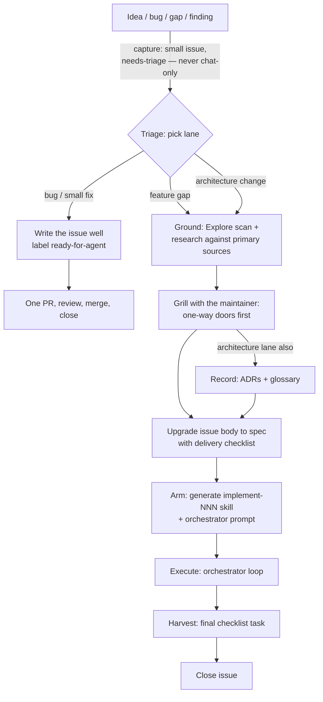
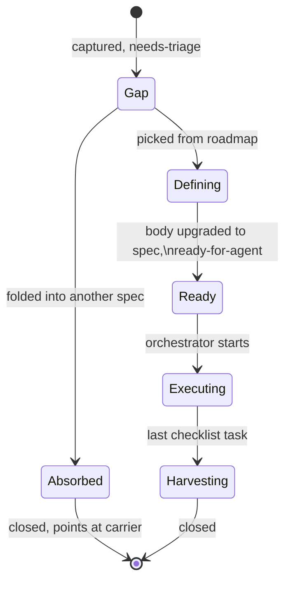
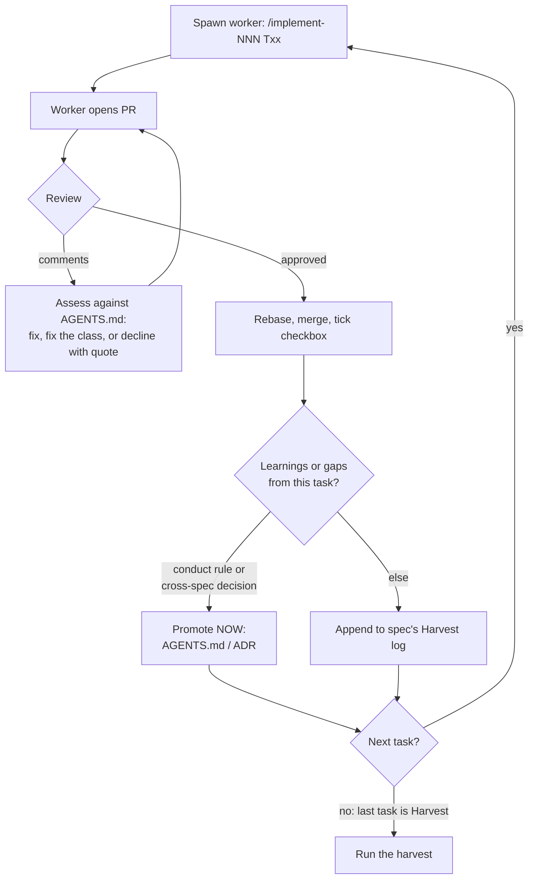

# Delivery process

How work moves from idea to merged code: capture, triage, definition, execution, harvest. This is the process that delivered #212 and #149, written down.

## Principles

1. **The issue body is the plan. Comments are events.** Reports, checkpoints, and discussion are comments. A comment that changes the plan is not done until the body reflects it.
2. **Specs are scaffolding.** They exist to build one thing reliably, then they close. Durable knowledge must move to a durable home before the spec closes (see table).
3. **A spec may only be quoted from inside its own work.** The moment a decision is quoted from another spec or epic, promote it to an ADR and quote the ADR.
4. **One issue per unit of work, upgraded in place.** A gap issue becomes the spec issue becomes the closed record. No parallel copies.
5. **Human time goes to gates.** Grilling answers, report approvals, harvest review. Agents do everything between gates.
6. **Weight by lane.** When unsure which lane, pick the lighter one.

## Skills by stage

Every stage of the pipeline has a skill. The skill is the operational how-to; this document is the why and the rules.

| Stage                                                                                      | Skill                                                                            |
| ------------------------------------------------------------------------------------------ | -------------------------------------------------------------------------------- |
| Capture a finding as a gap issue                                                           | `capture` (model-invocable — any session files findings the moment they surface) |
| Triage the queue                                                                           | `triage`                                                                         |
| Ground a roadmap item                                                                      | `research`, Explore scans                                                        |
| Grill the one-way doors                                                                    | `grilling`, `grill-with-docs`                                                    |
| Upgrade a gap into a spec                                                                  | `spec`                                                                           |
| Start an epic orchestrator                                                                 | `orchestrate <issue-nr \| labels...>` as the session's opening message           |
| (worker skills are generated by `orchestrate` at startup; templates live in its directory) |                                                                                  |
| Execute one task                                                                           | generated `implement-NNN` (bug lane: `implement`)                                |
| Close the spec                                                                             | `harvest`                                                                        |
| Brief the founder afterward                                                                | `spec-walkthrough`                                                               |

## Durable homes

| Knowledge                                                             | Home                                                               |
| --------------------------------------------------------------------- | ------------------------------------------------------------------ |
| Architecture decision, rejected alternative, deliberate "do not undo" | `docs/adr/`                                                        |
| Domain term                                                           | `CONTEXT.md` of the owning context (see `CONTEXT-MAP.md`)          |
| Rule for how agents work                                              | `AGENTS.md`, `docs/agents/`                                        |
| Tax/legal rationale for a number                                      | Legal reference data, treatment codes, the run's explanation trace |
| Reusable how-to                                                       | `.agents/skills/`                                                  |
| Anything else in a spec                                               | Dies with the spec                                                 |

## Pipeline



## Issue lifecycle



The issue number never changes. The body grows from problem statement to full spec; labels track the stage.

## Gap issue template

Captured at the moment of discovery by the `capture` skill — in any session, including mid-conversation, because a finding that lives only in chat is a finding lost. Problem only — no solutions.

```markdown
## Context

Where this was found, with links (spec, report, PR, review finding).

## Missing behavior

What does not happen today, in user terms, with one concrete example.

## Impact

Who is affected and how badly. Wrong numbers > blocked results > inconvenience.

## Evidence

The specific observation: counts, error codes, file references.

## Suggested lane

bug | feature gap | architecture change
```

Model example: #247.

## Spec template

Apply `AGENTS.md` "Communication" to the Problem and Solution: when the change depends on an unfamiliar relationship, explain it through one small example before the detailed decisions and task list. Show what happens today and what will change; keep proposed behavior clearly labeled.

The definition step rewrites the gap issue's body into:

```markdown
## Problem

(grown from the gap's Context + Missing behavior)

## Solution

What will be true afterward. Includes a short user-visible behavior list —
used to check the delivery checklist covers everything, not tracked as
separate checkboxes.

## Decisions

Recorded decisions this spec makes, including every intentional result
change. Quotable by PRs. Cross-spec decisions go to ADRs instead.

## Testing and seams

A compact mapping: behavior → owning task → named test/seam → expected outcome.
Use existing tests as prior art; update the map as the seams become concrete.

## Out of scope

Explicit no-list.

## Delivery checklist

- [ ] T01 — ...
- [ ] ...
- [ ] TNN — Harvest (see below; always the last task)

## Harvest log

(running list; the orchestrator appends learnings and gaps here as tasks
complete)
```

There is no separate acceptance-criteria section. Each task's checkbox text
carries its own acceptance behavior, result classification
(result-preserving or result-changing), test seam, and any decision it must
quote.

### Grounding and proof

Before cutting tasks that change persisted facts or derived results, trace one
representative flow through the read, acceptance, writer, and calculation seams
that exist. Name the actual inspected facts and where their links are recorded;
raw source fields may differ from the effective asset or valuation a user sees.
Expose a missing writer fact before designing a reader around it (ADR 0012).
When a decision keys on a stored column (a timestamp, a status), trace every
write of that column, not only the write that records the fact you want; a
progress or reset write can turn the value into a false negative (#108, D10).
For reader and UI lifecycle acceptance, verify that the tested states are
actually produced by writers and reach the read being used. Schema-valid
fixtures alone do not prove this, even for result-preserving consumers.
Decimal display and arithmetic proofs must consume the producer's serialized
values, including scientific notation, signed tiny amounts and zero. A plain
decimal fixture alone can miss a transport-format defect (#369 T02/T08).

Use the existing Testing and seams section to map each acceptance behavior to
its task, named test/seam, and exact expected outcome. This is proof coverage,
not a second checklist. Include rejection/no-write, decimal precision, replay,
and concurrency cases only where relevant. Put joined proof in the first task
where the required seams exist; a final verification task extends that proof
rather than collecting tests omitted from earlier tasks. For race tests,
distinguish a source replay read from an accounting input snapshot and place
the barrier at the boundary the claim concerns.

### Diagrams in specs

A spec gets a diagram when the diagram answers a question a reviewer would
otherwise have to ask. The trigger is the kind of complexity, not the part
of the system:

| Complexity in the spec                                           | Diagram                    |
| ---------------------------------------------------------------- | -------------------------- |
| A status or lifecycle (new or changed status enum)               | State diagram              |
| Ordering, atomicity, or concurrency across writers               | Sequence diagram           |
| A rule mapping (cause to treatment, input to outcome)            | Flowchart or a plain table |
| Relationship shape between tables (pointers, supersession links) | er-diagram, sparingly      |
| New dataflow across packages (architecture lane only)            | One component diagram      |

Rules:

- At most two diagrams per spec. Each states the question it answers and
  sits next to the Decisions it illustrates.
- Mermaid only. GitHub renders it, and the body is state — a diagram must be
  editable text or a re-scope will orphan it.
- Update or delete the diagram with every plan change. A stale diagram is
  false authority, worse than none.
- No class diagrams — inline the actual TypeScript shape when a type encodes
  a decision. No use-case diagrams — the behavior list covers it.
- If the lifecycle being drawn is permanent (for example a status machine
  the whole system relies on), the diagram belongs in the relevant ADR, not
  in the spec. Promote it there and link it.

Delivery checklist rules:

- One PR per checkbox, branched from latest `main` after the previous merges.
- Target 5–8 changed files including tests and migrations. Somewhat over is
  fine when the task requires it. Heading past ~15 files requires an explicit
  cut review: keep an honestly reviewable atomic change together, otherwise
  split it. Do not drop required facts or proof to meet an artificial count;
  the mechanical fixture category below remains separate.
- Verification tasks name the exact values they verify. "Compare results"
  invites verifying whatever is easy to compare.
- A task that deletes an old system gets an answer-key gate: the comparison
  against the old system happens first, and the maintainer approves the report before
  deletion starts.
- Gates are checklist items and name their approver.
- The file cut in a task is a target, checked against merged `main` before
  coding. A file-list correction found by that recheck is recorded on the
  issue and is not a design amendment. A third correction on one task means
  the task was cut wrong: recut it.
- Mechanical fixture alignment is a category, not a count. When a schema or
  contract change forces test fixtures to state a fact they already have
  (an explicit origin kind, a required tagged resolver), the cut is "the
  approved production artifacts plus every such fixture". Approve the
  category once; do not re-approve per file. Production growth still stops.
- A task that adds a required recorded-fact column to a derived table
  states its replay gate in the checklist text: the PR is incomplete until
  affected sources have replayed and the new column is verified populated
  by the writer (AGENTS.md, Database).
- A task that adds a counter or a last-time column names who serializes
  its writers; "facts only" is not a complete task (#133 T04, ADR 0017).

## Execution

The `orchestrate` skill generates the worker skill at startup from templates
that live inside its own directory (`.agents/skills/orchestrate/`), the way
`domain-modeling` carries its format files:

- **`implement-NNN` worker skill**: fixed reading list, allowed tasks, scope
  fence, result classification, domain rules that bite, seams, done
  criteria, coordination rules when several streams run.
- **Orchestrator prompt**: role and operating loop, judgment rules, stop
  conditions. Two template rules are non-negotiable: the orchestrator
  **never edits code** — every change goes through a spawned worker — and
  the prompt **carries no project state** — the tracker is the state, read
  at pickup, handoff, and decision changes. The newest recorded decision always
  wins over the prompt and the skill file; reuse unchanged reference docs.

The worker skill is spec-scoped scaffolding: the harvest deletes it.
Orchestrator sessions are started with the `orchestrate` skill as the opening
message (`orchestrate 247` for a spec epic, `orchestrate assets transactions`
for a queue epic — a labeled set of small issues with no checklist, where each
issue body plus its recorded comments is the worker's spec). The skill loads
the matching role template from its own directory and binds it live from the
tracker; no prompt files are generated or pasted.

The orchestrator's loop begins each task with a **pickup audit** against
merged `main`: stale references, ADR conflicts, and an honest PR estimate —
more than 2 PRs means a split proposal, not a start. Apply
[Grounding and proof](#grounding-and-proof) when the task changes persisted
facts or derived results.
The orchestrator loop:



Two orchestrators may run in parallel. Rules: rebase before opening and
before merging; one merge at a time across all streams; never two unmerged
PRs with Drizzle migrations; a conflict outside the task's surface stops the
worker, who reports instead of resolving.

### Worker ownership and handoff

One lead owns a worker's assignment until it explicitly releases or transfers
that ownership. Give helpers disjoint files or responsibilities; do not reassign
an active helper behind its lead. Handoffs state head/base, changed files,
completed checks and their evidence, remaining work, and blockers. Refresh the
tracker at pickup, handoff, and decision changes, not on every status poll.
Progress updates report meaningful findings, current checks, or blockers within
the session's communication requirements; do not narrate unchanged polling.

### Validation and test reliability

Choose local checks by what changed. Prose-only edits need scoped formatting,
reference checks, and relevant skill validation; do not repeat unchanged app
builds or runtime suites solely for prose. Executable, configuration, schema,
and test changes need the affected and full gates required by the task and
repository. Judge what a file does, not its extension: scripts or configuration
are not prose. Explicit task gates, required hosted CI, and independent review
still apply. Merge only after required CI and review approve the exact final
commit, subject to the `AGENTS.md` exception for carrying automated Codex
approval across an unaffected rebase. Rerun checks when subsequent changes invalidate their evidence.

Install dependencies with the repository lifecycle enabled before validation.
If installation used `--ignore-scripts`, run `mise x -- pnpm run prepare` before
checking code. This installs the Effect compiler and linter patches used by CI;
unpatched local tools can silently miss failing diagnostics. After correcting
the tool setup, clear compiler build-info files and bypass task caches for the
checks whose earlier results used unpatched tools.

Finish code generation before capturing browser screenshots or other browser
proof, so generated-file changes cannot race the rendered app.

Exercise browser controls through their actual primitives and native input
behavior. Mocked handlers do not prove keyboard event ownership, partial date
input validity, or an open form's restoration after browser Back. Check focus
and held-pointer targets, scroll reachability with enlarged text, and computed
enter/exit styles under reduced motion; a class name alone does not prove the
CSS wins. State when browser proof uses synthetic data rather than authenticated
loaders and backend reads (#370 T06–T08).

For tests that open local listeners, default to OS-assigned ports (port 0)
and read the actual bound address, unless the behavior under test requires a
known port. Bind to the same loopback address the client uses; do not replace
an IPv6 wildcard listener address with an IPv4 client address. Scope resources
to the test, including independent
concurrent instances. Fixtures crossing a real boundary must contain realistic,
valid typed facts; do not bypass a schema to make the fixture pass.

Diagnose full-suite failures from their actual errors. An isolated rerun helps
locate the problem; it does not replace the failing full gate. Fix a confirmed
defect or establish the cause and rerun the required full gate. Do not raise
timeouts or add blind random retries to conceal failures. Schedule heavy builds,
replays, and full suites sequentially when they compete for local resources;
independent read-only review may overlap safe checks. A bounded diagnostic run
does not waive required hosted settings or the existing red-gate rule in AGENTS.md.

When measured host contention justifies an authorized local worker reduction,
verify the effective limit for each test project. In the current Vitest setup,
a CLI `maxWorkers` value does not override explicit project settings. Any
temporary config must preserve test inclusion, setup, coverage and timeouts;
report actual limits and remove it after the complete gate. Hosted CI keeps
its normal settings (#370 T08).

### Pre-launch migration planning

For schema tasks, distinguish generated schema changes and any required audit
trigger DDL from deliberate clearing/replay outside the migration chain. Plan
both before implementation; migrations remain schema-only under AGENTS.md.
If generation cannot express required protection, prepare the exact missing DDL
for review without silently weakening the protection. Once the maintainer
approves the specific custom SQL, generate a separate custom migration through
`mise x -- pnpm --filter @my/persistence run migration:generate --custom --name=<name>`.
Put the approved guards or constraint DDL only in that custom migration; keep
the generated schema SQL untouched and retain Drizzle's tracking artifacts
(#369 T05 correction 2, PR #384). Validate the normal migration chain, not just
DDL installed outside it in a preview database. AGENTS.md's approval for
hand-editing a specific migration still governs. Carry existing authorization
forward within its actual file/task/action scope; a past exception is neither
blanket permission for manual SQL nor permission to clear another database.

## Harvest

The mandatory final checklist task of every spec. Steps:

1. Process the Harvest log plus one sweep of the whole epic. Promote what
   meets the bar: quoted cross-spec → ADR; changes user-visible numbers →
   legal reference data / treatment codes / ADR; rule of conduct →
   `AGENTS.md`; new term → glossary.
2. File every remaining gap as a new `needs-triage` issue via the `capture`
   skill. Link them from the roadmap. Then run the blocker sweep against
   the live local database: list the active runs' blocker codes with
   counts; every code with no recorded rule and no open issue gets a gap
   issue. Check the active runs themselves first: an active run older than
   the last fact replay is stale evidence, and its blockers may point at
   rows that no longer exist. Report counts from fresh runs only, and file
   the staleness as its own gap. Record live schema compatibility separately
   from input freshness. Label an older-schema census as evidence from the
   live deployment and name any current-code checks that could not run. If
   a disposable copy is used, report its source and any migrations or
   recomputes separately; do not present it as unchanged live evidence.
3. Delete the spec's `implement-NNN` skill (and symlink) and its
   orchestrator prompt.
4. Update the reusable templates and skills with what the epic taught.
5. Post a closing summary comment (an event) and close the issue.

After the harvest, the founder can run `/spec-walkthrough` on the closed
spec: a tech-lead briefing built from the final body and the merged PRs'
result classifications — what changed, which numbers changed on purpose,
and a manual test plan. It reads state, not the comment log.

Reports containing real user data follow `docs/agents/issue-tracker.md`:
redacted summary on the issue, full report in a local file.

## Roadmap

One map issue per goal (wayfinder pattern): the body holds the ordered gap
list and an explicit Fog section for known unknowns. Picking an item off the
map is the manual act that starts its definition lane. The map's body is
state; keep it current like any spec body.
