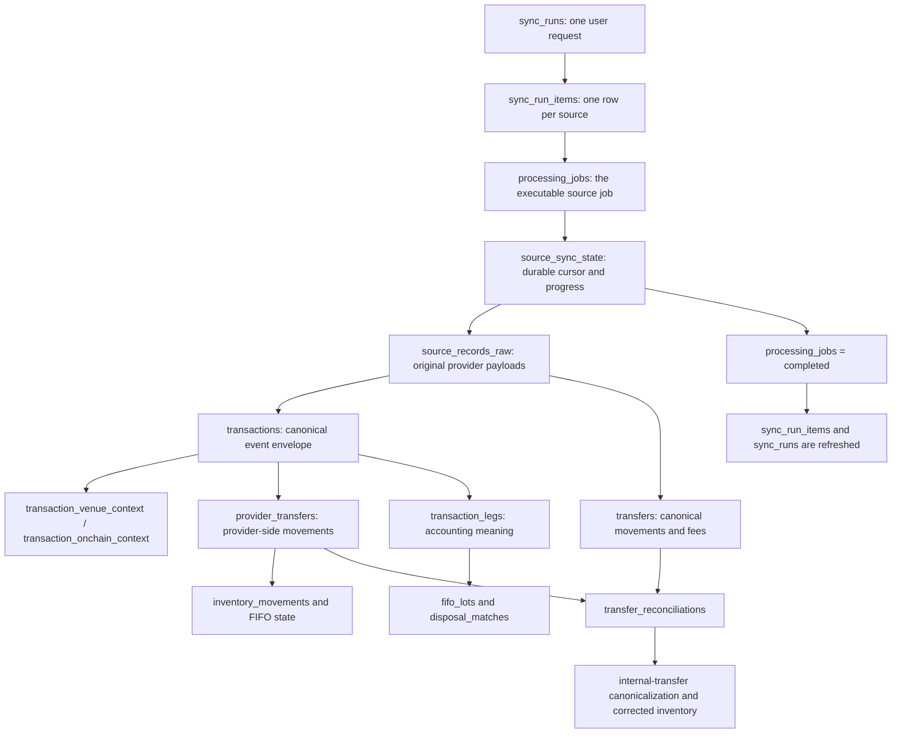

# The life of a sync job in the data layer

This document follows a sync from the moment a user asks TaxMaxi to sync until the last database status is marked complete. It focuses on the data layer: which rows are created, how they are linked, and which services write them.

## The short version

A sync has three different kinds of memory:

1. **The request** — `sync_runs`, `sync_run_items`, and `processing_jobs` say what the user asked for and whether each source job is queued, running, complete, or failed.
2. **The import memory** — `source_sync_state` and `source_records_raw` let TaxMaxi resume remote fetching and reprocess original provider data without downloading it again.
3. **The useful result** — `transactions`, contexts, transfers, transaction legs, inventory rows, and reconciliation rows turn provider payloads into data used by the portfolio and tax calculations.

The most important distinction is between `provider_transfers` and `transfers`:

- A **provider transfer** is a movement reported by a custody provider such as Coinbase. It can exist before its asset is fully mapped or its matching onchain movement is known.
- A **transfer** is a provider-neutral movement with a canonical TaxMaxi asset. In the current normalization path, this table is used mainly for onchain movements and explicit fee transfers.
- `transfer_reconciliations` is the bridge between the two. It says that a provider-side withdrawal or deposit is the same real-world movement as a canonical onchain transfer, or records why that match is still pending.

Here is the main path:



## Meet the durable records

Before following the story, it helps to know the main records by role.

| Record                                                      | What it means                                                                                      | Main links                                                                                         |
| ----------------------------------------------------------- | -------------------------------------------------------------------------------------------------- | -------------------------------------------------------------------------------------------------- |
| `sources`                                                   | A user-owned wallet, exchange account, or other import source. This is the root of the whole tree. | Belongs to a `principal`; referenced by almost every sync table.                                   |
| `sync_runs`                                                 | One user-wide “sync everything” request.                                                           | Belongs to a `principal`; has many `sync_run_items`.                                               |
| `sync_run_items`                                            | The part of a run assigned to one source.                                                          | Links `sync_runs`, `sources`, and usually one `processing_jobs` row.                               |
| `processing_jobs`                                           | The actual unit claimed by a worker.                                                               | Belongs to one source and principal; carries queue, attempt, heartbeat, and per-job progress data. |
| `source_sync_state`                                         | The source’s memory across jobs.                                                                   | One row per source; may point at the last raw checkpoint row.                                      |
| `source_records_raw`                                        | An idempotent cache of original provider records.                                                  | Belongs to a source; later rows link back through `source_raw_record_id`.                          |
| `transactions`                                              | A provider-neutral event envelope such as a buy, send, swap, or chain transaction.                 | Belongs to a source and principal; may link to a raw row.                                          |
| `transaction_venue_context` / `transaction_onchain_context` | Details that only make sense for an exchange or chain transaction.                                 | One-to-one companions of a transaction.                                                            |
| `provider_transfers`                                        | Custody-provider movements before cross-provider reconciliation.                                   | Belongs to a transaction, raw row, source, and provider asset.                                     |
| `transfers`                                                 | Canonical asset movements used for onchain matching, explanation, and some leg derivation.         | Belongs to a source, principal, asset, and usually a raw row.                                      |
| `transaction_legs`                                          | Accounting meaning: acquisition, disposal, income, or fee.                                         | Belongs to a transaction and can point to a canonical transfer.                                    |
| `inventory_movements`                                       | Factual custody movement, kept separate from tax meaning.                                          | Comes from exactly one provider transfer or one fee leg.                                           |
| `fifo_lots`                                                 | Units available for FIFO accounting.                                                               | Originates from exactly one acquisition leg or inbound provider transfer.                          |
| `disposal_matches`                                          | The FIFO lots consumed by a taxable disposal leg.                                                  | Joins a disposal leg to a FIFO lot.                                                                |
| `inventory_movement_allocations`                            | The FIFO lots consumed by a custody movement that is not yet a tax disposal.                       | Joins an inventory movement to a FIFO lot.                                                         |
| `transfer_reconciliations`                                  | The decision that links a provider transfer to a canonical transfer/transaction.                   | One row per provider transfer, optionally pointing to canonical targets.                           |
| `transaction_reviews`                                       | A durable explanation that a transaction needs human review.                                       | One-to-one with a transaction.                                                                     |

The table definitions are in [`packages/persistence/src/schema`](../packages/persistence/src/schema/index.ts). The source root is documented in [`SourcesTable.ts`](../packages/persistence/src/schema/SourcesTable.ts), job state in [`ProcessingJobsTable.ts`](../packages/persistence/src/schema/ProcessingJobsTable.ts), and the central accounting rows in [`TransactionsTable.ts`](../packages/persistence/src/schema/TransactionsTable.ts), [`TransfersTable.ts`](../packages/persistence/src/schema/TransfersTable.ts), [`ProviderTransfersTable.ts`](../packages/persistence/src/schema/ProviderTransfersTable.ts), and [`TransactionLegsTable.ts`](../packages/persistence/src/schema/TransactionLegsTable.ts).

## Chapter 1: the user starts a run

The public “sync all my sources” request enters through `SyncRunsApiLive`. The API resolves the current user to a principal and calls `SourceSyncRunService.startSyncRun` ([handler](../packages/rest-api/src/layers/SyncRunsApiLive.ts#L67)).

`SourceSyncRunServiceLive` first asks `SourceRepository` for every source owned by that principal. The live repository reads `sources` and joins `addresses` so an onchain provider receives the wallet address it needs ([source lookup](../packages/persistence/src/layers/SyncEngineSourceRepositoryLive.ts)).

The service then creates one `sync_runs` row with the number of requested sources. This row is the user-facing parent, not the worker’s unit of work. With no sources, it is immediately completed with “No sources to sync.” Otherwise it starts as queued ([run creation](../packages/persistence/src/layers/SourceSyncRunRepositoryLive.ts#L282)).

For each source, `SourceSyncRunServiceLive` calls `SourceSyncService.startSourceSyncJob`, up to four sources at once ([run orchestration](../packages/sync-engine/src/layers/SourceSyncRunServiceLive.ts#L107)). A source that cannot be dispatched still gets a failed `sync_run_items` row, so the parent run does not wait forever for a child that was never created.

## Chapter 2: a source becomes a durable job

`SourceSyncServiceLive` validates that the source belongs to the principal and has a supported `provider_key`. It then checks `processing_jobs` for an existing pending or processing job ([source job orchestration](../packages/sync-engine/src/layers/SourceSyncServiceLive.ts#L166)).

This is where duplicate clicks and competing requests are made safe:

- `processing_jobs` has a partial unique index that allows only one pending or processing job per source.
- If an active job already exists, the request usually reuses it.
- If a replay is requested behind an ordinary sync, `follow_up_mode` remembers that replay. Completing or failing the active job creates the follow-up job and links it through `follow_up_job_id`.
- A processing job that has stopped updating can be marked failed as stale before a new job is created.

The write logic lives in `SourceSyncJobRepositoryLive`: `createOrReuseJob` inserts the pending row, and later methods attach queue details, claim it, heartbeat it, retry it, complete it, or fail it ([repository](../packages/persistence/src/layers/SourceSyncJobRepositoryLive.ts)).

Once a job exists, `SourceSyncRunRepository.attachRunItem` inserts the `sync_run_items` row that connects:

```text
sync_runs.id -> sync_run_items.run_id
sources.id -> sync_run_items.source_id
processing_jobs.id -> sync_run_items.processing_job_id
```

This is why a run can show one status line per source while each source still has its own retry and resume history.

## Chapter 3: Postgres hands the job to BullMQ

The API process adds a small payload containing the job, source, principal, and mode to BullMQ. The BullMQ id is deliberately the same as the database job id, making repeated enqueue attempts idempotent. After the queue accepts the item, `SourceSyncJobRepository.attachQueueMetadata` writes `queue_name`, `queue_job_id`, and `queued_at` into `processing_jobs` ([queue producer](../apps/server/src/layers/ApiBullMqSourceSyncQueueLive.ts#L239)).

Postgres remains the durable source of truth. BullMQ moves work between processes, but it does not own the public status. This matters after a crash: the worker has startup repair and a periodic scan that can redispatch pending database jobs whose queue metadata is absent or stale ([worker consumer](../apps/worker/src/layers/WorkerBullMqSourceSyncConsumerLive.ts)).

When a worker receives the queue item, it calls `SourceSyncJobExecutor.execute`. The executor reads the database job and atomically changes it from `pending` to `processing`, recording `worker_id`, `started_at`, and `heartbeat_at`. Only a pending job can be claimed, which prevents two workers from processing the same job ([claim write](../packages/persistence/src/layers/SourceSyncJobRepositoryLive.ts#L402)).

## Chapter 4: the provider prepares its dictionary

Before fetching user records, the executor resolves the provider module through `SourceProviderRegistryLive`. Today that registry routes `coinbase` and `helius-solana` sources ([registry](../packages/sync-engine/src/layers/SourceProviderRegistryLive.ts)). Each provider supplies three operations: refresh reference data, fetch a raw page, and build a raw-record normalizer.

The reference refresh makes provider language understandable to the rest of TaxMaxi. For Coinbase it writes:

- `provider_transaction_type_catalog`, through `ProviderReferenceRepository.upsertTransactionTypeCatalog`;
- `provider_transaction_type_mappings`, through `ProviderReferenceRepository.ensureTransactionTypeMappings`;
- `provider_assets`, through `ProviderAssetRepository.upsertProviderAssets`;
- `provider_asset_mappings`, through the provider’s default mapping service and `ProviderAssetRepository`.

The Coinbase flow is visible in [`CoinbaseReferenceDataServiceLive.ts`](../packages/sync-engine/src/providers/coinbase/layers/CoinbaseReferenceDataServiceLive.ts). The SQL-facing implementations are [`ProviderReferenceRepositoryLive.ts`](../packages/persistence/src/layers/ProviderReferenceRepositoryLive.ts) and [`ProviderAssetRepositoryLive.ts`](../packages/persistence/src/layers/ProviderAssetRepositoryLive.ts). Helius/Solana currently ensures its default asset mappings rather than refreshing the Coinbase-style catalogs.

These tables are shared reference data, not rows owned by a single sync job. Refreshing them at the start ensures that a later raw record can turn a provider currency or provider transaction type into a canonical asset and tax meaning.

## Chapter 5: the source remembers where it left off

The executor loads `source_sync_state` before calling the provider. Unlike `processing_jobs`, this record survives across jobs and has one row per source ([state repository](../packages/persistence/src/layers/SourceSyncStateRepositoryLive.ts)). It stores:

- `cursor_payload`: opaque provider pagination state;
- `high_watermark`: the latest safely seen event time;
- `checkpoint_external_id`: the provider id at the resume boundary;
- `checkpoint_raw_record_id`: the exact cached raw row at that boundary;
- `last_synced_at` and `last_error_message`.

The executor starts in the `discovering` phase and writes progress twice: durable resume fields go to `source_sync_state`, while the user-facing phase and counters go into `processing_jobs.progress_details`. The two writes are performed by `SourceSyncStateRepository.persistProgress` ([progress persistence](../packages/persistence/src/layers/SourceSyncStateRepositoryLive.ts#L66)).

This split is intentional:

- `processing_jobs` answers “what happened in this attempt?”
- `source_sync_state` answers “where should the next attempt or next sync resume?”

There is also a `sources.last_synced_at` column, but the current sync path does not write it. Current reporting reads `source_sync_state.last_synced_at` instead. Treat the state table as authoritative for sync completion time.

## Chapter 6: provider pages become an immutable-ish inbox

The provider fetches one page at a time using the saved cursor, high-water mark, and checkpoint. The executor does **not** immediately turn that response into tax data. It first passes every page to `SourceRawRecordRepository.upsertRawBatch` ([discovery loop](../packages/sync-engine/src/layers/SourceSyncJobExecutorLive.ts#L528), [raw repository](../packages/persistence/src/layers/SourceRawRecordRepositoryLive.ts#L38)).

Rows land in `source_records_raw` with:

- the source and provider;
- a provider-specific record type;
- provider ids and parent ids;
- the occurrence time;
- the complete original payload;
- later, either `normalized_at` or `normalization_error`.

The unique key `(source_id, record_type, external_record_id)` means a repeated page updates the same cached fact instead of duplicating it. After each page, the latest raw id and provider id become the new checkpoint, the cursor is saved, the imported counter advances, and the worker writes a heartbeat.

This raw table is the safety net of the design. Once provider data is cached here, TaxMaxi can fix normalization rules and replay the data locally without calling the remote provider again.

## Chapter 7: the inbox is translated into accounting data

Only after all remote pages are cached does the job enter `classifying`. The executor lists every raw row whose `normalized_at` is still null and processes them in batches ([classification loop](../packages/sync-engine/src/layers/SourceSyncJobExecutorLive.ts#L307)).

The provider module translates one raw record into a prepared bundle. `SourceProviderRegistryLive` shows the common shape of that bundle: a transaction, venue or chain context, provider transfers, canonical fee transfers, a review decision, and a function that derives transaction legs ([normalizer adapters](../packages/sync-engine/src/layers/SourceProviderRegistryLive.ts#L65)).

The whole bundle is handed to `SourceNormalizationRepository.persistNormalizedArtifacts`. This repository is the main data-layer writer of sync results, and it handles one raw record in a single database transaction ([atomic persistence](../packages/persistence/src/layers/SourceNormalizationRepositoryLive.ts#L1931)).

Inside that database transaction, the story unfolds in this order.

### 7.1 The transaction envelope

The repository upserts `transactions` by `(source_id, external_id)`. This is the common identity, timestamp, provider type/status, principal, and metadata for the event. It points back to `source_records_raw` through `source_raw_record_id`.

The repository then upserts one `transaction_venue_context` row. For an exchange this contains facts such as side, instrument, fill price, order id, fill id, and commission. It also upserts or removes `transaction_onchain_context`, which carries chain, address, hash, block, gas, and function details when the transaction came from a chain.

The split keeps the central `transactions` row readable instead of mixing every exchange and chain field into it.

### 7.2 Provider movements and canonical movements

The repository upserts provider-reported movements into `provider_transfers`. Each row belongs to the new transaction and normally points to a `provider_assets` row. It keeps provider account references, addresses, network hints, direction, and amount even when canonical asset mapping or onchain matching is not ready.

Separately, `fee_transfers` are upserted into `transfers`. For Helius/Solana, canonical onchain movements also arrive in this part of the prepared result. The `transfers` table requires a canonical `asset_id` and contains the provider-neutral movement shape used later by reconciliation.

This explains why the tables are not duplicates:

```text
provider_transfers                         transfers
------------------                        ---------
What Coinbase/provider reported           Canonical movement TaxMaxi can compare across sources
Can point to an unmapped provider asset    Always points to a canonical asset
Always belongs to a transaction            May be linked to a transaction through context/legs
Input side of reconciliation               Candidate canonical side of reconciliation
```

### 7.3 Transaction legs

After the transaction and movements have database ids, the provider’s leg derivation service creates `transaction_legs`. A leg is not another copy of a transfer. It is the accounting statement made from the evidence:

- `acquisition`: units entered inventory;
- `disposal`: units left in a tax-relevant way;
- `income`: units were received as income;
- `fee`: units paid as a cost.

A swap can therefore have multiple legs even though it is one transaction. A leg may point at `source_transfer_id` when it came from a canonical transfer and at `transaction_id` for its parent event. The schema and its accounting rules are in [`TransactionLegsTable.ts`](../packages/persistence/src/schema/TransactionLegsTable.ts).

### 7.4 FIFO and custody inventory

Normalization immediately feeds the derived facts into inventory state:

- Acquisition and income legs can create or update `fifo_lots`.
- Disposal legs consume those lots in chronological order and create `disposal_matches`, including cost basis, proceeds, and gain/loss.
- Completed provider transfers create `inventory_movements`. An inbound movement can create a provider-origin FIFO lot; an outbound movement consumes lots through `inventory_movement_allocations`.
- Fee legs also become outbound inventory movements and allocations.

The separation between `disposal_matches` and `inventory_movement_allocations` is important. A disposal is a tax claim. A custody movement is merely evidence that units moved. Reconciliation may later prove that an exchange withdrawal was an internal transfer rather than a disposal.

If the source does not yet have enough inventory to cover an outbound row, the transaction is not silently discarded. Its `transaction_reviews` row is marked `needs_review` with an explanation that opening balance or acquisition history is likely missing.

The detailed write order and FIFO allocation code are all in [`SourceNormalizationRepositoryLive.ts`](../packages/persistence/src/layers/SourceNormalizationRepositoryLive.ts). The related schemas are [`FifoLotsTable.ts`](../packages/persistence/src/schema/FifoLotsTable.ts), [`DisposalMatchesTable.ts`](../packages/persistence/src/schema/DisposalMatchesTable.ts), and [`InventoryMovementsTable.ts`](../packages/persistence/src/schema/InventoryMovementsTable.ts).

### 7.5 The raw row is acknowledged last

Only after all of those writes succeed does the same transaction set `source_records_raw.normalized_at` and clear `normalization_error`. If any database write fails, the database transaction rolls back and the raw row remains eligible for another attempt.

A provider-specific, recoverable normalization problem is handled differently: the executor writes the error text on the raw row and continues with the rest of the batch. Once all pages have been cached, it retries failed raw rows once more. This helps when one record needed a related record that appeared on a later provider page ([end-of-sync replay](../packages/sync-engine/src/layers/SourceSyncJobExecutorLive.ts#L405)).

## Chapter 8: two views of one transfer are reconciled

After classification, the job enters `reconciling`. `TransferReconciliationServiceLive` reads every `provider_transfers` row for the source, joining its approved `provider_asset_mappings` row when one exists ([reconciliation service](../packages/sync-engine/src/layers/TransferReconciliationServiceLive.ts)).

For each provider transfer it searches `transfers` across all sources owned by the same principal. Matching uses:

- the canonical asset and, when known, asset representation;
- direction and the wallet-side address;
- a twelve-hour time window;
- exact amount;
- network name and transaction hash when available.

The result is upserted into `transfer_reconciliations` by `TransferReconciliationRepositoryLive` ([repository](../packages/persistence/src/layers/TransferReconciliationRepositoryLive.ts#L187)):

- `pending` when asset mapping, wallet data, or an onchain candidate is missing;
- `needs_review` when more than one exact candidate exists;
- `auto_applied` when there is one deterministic exact match;
- `approved` or `rejected` when a reviewer has decided.

Each row always points to the provider transfer. Successful matches also point to the canonical transfer and transaction. The schema is in [`TransferReconciliationsTable.ts`](../packages/persistence/src/schema/TransferReconciliationsTable.ts).

The service then applies deterministic internal-transfer canonicalization. This is more than adding a label. It can adjust transaction legs, reviews, FIFO lots, disposal matches, inventory movements, and allocations so that the same movement seen by an exchange and a wallet is not taxed or counted twice. Because those changes can affect later FIFO use, the repository locks all connected source inventories and can rebuild dependent allocations in time order. The detailed recovery logic starts in [`TransferReconciliationRepositoryLive.ts`](../packages/persistence/src/layers/TransferReconciliationRepositoryLive.ts#L236).

## Chapter 9: completion moves back up the tree

When reconciliation and canonicalization finish, the executor writes `phase = completed` and `last_synced_at` to `source_sync_state`, and writes the final progress snapshot to `processing_jobs.progress_details` ([sync completion](../packages/sync-engine/src/layers/SourceSyncJobExecutorLive.ts#L683)). It then calls `SourceSyncJobRepository.completeJob`, which changes the claimed job from `processing` to `completed`, adds `completed_at`, and persists the final checkpoint ([job completion](../packages/persistence/src/layers/SourceSyncJobRepositoryLive.ts#L605)).

The parent `sync_runs` row is not updated by a worker callback. Instead, when the API starts or reads a run, `SourceSyncRunRepository.refreshRunStatus` does the following in a transaction:

1. copies each linked `processing_jobs.status` into `sync_run_items.status`;
2. counts queued, running, completed, and failed items;
3. updates the counters and overall status on `sync_runs`;
4. sets `completed_at` when every requested source has reached a terminal state.

That refresh is in [`SourceSyncRunRepositoryLive.ts`](../packages/persistence/src/layers/SourceSyncRunRepositoryLive.ts#L425). A run becomes `completed`, `failed`, or `partially_failed` depending on the mix of child results.

## What happens on failure or retry?

The failure path preserves enough data to explain and continue the work.

- A retryable provider failure writes the message to `source_sync_state.last_error_message`, returns `processing_jobs` to `pending`, increments its attempt count, clears the worker claim, and records `next_retry_at`. BullMQ then retries with exponential backoff.
- A final or non-retryable failure writes the state error and changes `processing_jobs` to `failed` with `completed_at` and `error_message`.
- Raw pages and successful normalized records already committed before the failure remain in Postgres. A new attempt resumes from `source_sync_state` and skips raw rows whose `normalized_at` is already set.
- Heartbeats on `processing_jobs` let startup repair identify work abandoned by a dead worker.
- A queued replay request is turned into a linked follow-up job even when the current job fails.

The executor chooses retry versus final failure in [`SourceSyncJobExecutorLive.ts`](../packages/sync-engine/src/layers/SourceSyncJobExecutorLive.ts#L890), while the state changes live in [`SourceSyncJobRepositoryLive.ts`](../packages/persistence/src/layers/SourceSyncJobRepositoryLive.ts#L435).

## Replay: rebuilding the result without redownloading it

A replay uses the same `processing_jobs` machinery but sets `mode = replay`. It does not call the provider for pages. `SourceReplayRepository.resetSourceDerivedState` first checks that deleting this source’s FIFO state will not break later allocations belonging to another source. If it is safe, it:

1. restores FIFO quantities consumed by this source;
2. deletes this source’s transaction legs, transactions, and transfers; cascading foreign keys remove many dependent rows;
3. clears normalization state on this source’s `source_records_raw` rows;
4. runs the ordinary classification and reconciliation stages again from the cached payloads.

The reset is in [`SourceReplayRepositoryLive.ts`](../packages/persistence/src/layers/SourceReplayRepositoryLive.ts), and replay orchestration is in [`SourceSyncJobExecutorLive.ts`](../packages/sync-engine/src/layers/SourceSyncJobExecutorLive.ts#L741).

## Which service writes which table?

This is the compact lookup when reading code. “Writes” includes inserts, updates, and deletes in the normal sync or replay path.

| Table                                | Main writer                                                                                                                                      | Why it writes                                                                                                       |
| ------------------------------------ | ------------------------------------------------------------------------------------------------------------------------------------------------ | ------------------------------------------------------------------------------------------------------------------- |
| `sync_runs`                          | `SourceSyncRunRepositoryLive`                                                                                                                    | Creates the parent request and refreshes aggregate status/counters.                                                 |
| `sync_run_items`                     | `SourceSyncRunRepositoryLive`                                                                                                                    | Attaches one source job to the run, records dispatch failures, and mirrors job status.                              |
| `processing_jobs`                    | `SourceSyncJobRepositoryLive`; progress fields also by `SourceSyncStateRepositoryLive`                                                           | Creates and claims work, stores queue metadata, attempts, heartbeat, errors, checkpoints, progress, and completion. |
| `source_sync_state`                  | `SourceSyncStateRepositoryLive`                                                                                                                  | Stores the cross-job cursor, high-water mark, checkpoint, completion time, and last error.                          |
| `source_records_raw`                 | `SourceRawRecordRepositoryLive`; acknowledgment also by `SourceNormalizationRepositoryLive`; reset by `SourceReplayRepositoryLive`               | Caches provider payloads, marks normalization success/failure, and makes replay possible.                           |
| `provider_transaction_type_catalog`  | `ProviderReferenceRepositoryLive`                                                                                                                | Stores known provider transaction types.                                                                            |
| `provider_transaction_type_mappings` | `ProviderReferenceRepositoryLive`                                                                                                                | Maps provider types to TaxMaxi transaction and inventory meaning.                                                   |
| `provider_assets`                    | `ProviderAssetRepositoryLive`                                                                                                                    | Stores provider-native currency/token identities.                                                                   |
| `provider_asset_mappings`            | `ProviderAssetRepositoryLive`                                                                                                                    | Maps provider assets to canonical assets, representations, or fiat.                                                 |
| `transactions`                       | `SourceNormalizationRepositoryLive`; later adjusted by `TransferReconciliationRepositoryLive`; deleted on replay by `SourceReplayRepositoryLive` | Stores the common event envelope and final transaction type.                                                        |
| `transaction_venue_context`          | `SourceNormalizationRepositoryLive`                                                                                                              | Stores exchange/order/fill-specific context.                                                                        |
| `transaction_onchain_context`        | `SourceNormalizationRepositoryLive`                                                                                                              | Stores chain/hash/block/gas-specific context.                                                                       |
| `provider_transfers`                 | `SourceNormalizationRepositoryLive`                                                                                                              | Stores provider-reported custody movements.                                                                         |
| `transfers`                          | `SourceNormalizationRepositoryLive`; deleted on replay by `SourceReplayRepositoryLive`                                                           | Stores canonical movements, including onchain candidates and fee movements.                                         |
| `transaction_legs`                   | `SourceNormalizationRepositoryLive`; adjusted by `TransferReconciliationRepositoryLive`; deleted on replay by `SourceReplayRepositoryLive`       | Stores acquisition, disposal, income, and fee meaning.                                                              |
| `transaction_reviews`                | `SourceNormalizationRepositoryLive` and `TransferReconciliationRepositoryLive`                                                                   | Records uncertain mappings, insufficient inventory, or reconciliation issues.                                       |
| `fifo_lots`                          | `SourceNormalizationRepositoryLive`, `TransferReconciliationRepositoryLive`, and `SourceReplayRepositoryLive`                                    | Creates inventory lots and adjusts their remaining quantity as facts are rebuilt.                                   |
| `disposal_matches`                   | `SourceNormalizationRepositoryLive` and `TransferReconciliationRepositoryLive`                                                                   | Connects tax disposal legs to the FIFO lots they consume.                                                           |
| `inventory_movements`                | `SourceNormalizationRepositoryLive` and `TransferReconciliationRepositoryLive`                                                                   | Stores custody movement facts separately from tax classification.                                                   |
| `inventory_movement_allocations`     | `SourceNormalizationRepositoryLive`, `TransferReconciliationRepositoryLive`, and replay reset logic                                              | Connects outbound custody movements to FIFO lots without declaring a tax disposal.                                  |
| `transfer_reconciliations`           | `TransferReconciliationRepositoryLive`                                                                                                           | Stores the provider-to-canonical match and its status/reason.                                                       |

## A practical reading path through the code

For a top-to-bottom code walk, read these files in order:

1. [`SyncRunsApiLive.ts`](../packages/rest-api/src/layers/SyncRunsApiLive.ts) — the public request and response.
2. [`SourceSyncRunServiceLive.ts`](../packages/sync-engine/src/layers/SourceSyncRunServiceLive.ts) — one user-wide run becomes source jobs.
3. [`SourceSyncServiceLive.ts`](../packages/sync-engine/src/layers/SourceSyncServiceLive.ts) — active-job reuse, stale recovery, and enqueue decisions.
4. [`SourceSyncJobRepositoryLive.ts`](../packages/persistence/src/layers/SourceSyncJobRepositoryLive.ts) — the `processing_jobs` state machine.
5. [`WorkerBullMqSourceSyncConsumerLive.ts`](../apps/worker/src/layers/WorkerBullMqSourceSyncConsumerLive.ts) — queue consumption and retry behavior.
6. [`SourceSyncJobExecutorLive.ts`](../packages/sync-engine/src/layers/SourceSyncJobExecutorLive.ts) — the full discovering → classifying → reconciling → completed story.
7. [`SourceRawRecordRepositoryLive.ts`](../packages/persistence/src/layers/SourceRawRecordRepositoryLive.ts) — the raw inbox and replay markers.
8. [`SourceProviderRegistryLive.ts`](../packages/sync-engine/src/layers/SourceProviderRegistryLive.ts) — how provider-specific normalization fits the common executor.
9. [`SourceNormalizationRepositoryLive.ts`](../packages/persistence/src/layers/SourceNormalizationRepositoryLive.ts) — the atomic write of transactions, transfers, legs, reviews, and inventory.
10. [`TransferReconciliationServiceLive.ts`](../packages/sync-engine/src/layers/TransferReconciliationServiceLive.ts) and [`TransferReconciliationRepositoryLive.ts`](../packages/persistence/src/layers/TransferReconciliationRepositoryLive.ts) — cross-source matching and internal-transfer repair.
11. [`SourceSyncRunRepositoryLive.ts`](../packages/persistence/src/layers/SourceSyncRunRepositoryLive.ts) — how the user-wide status catches up with child jobs.

The core idea throughout is that the raw provider fact is kept, every derived row retains a path back to its source, and each risky multi-table rewrite happens in a database transaction. The job can therefore resume after infrastructure failure, retry a bad row, or replay new rules without losing the original evidence.
